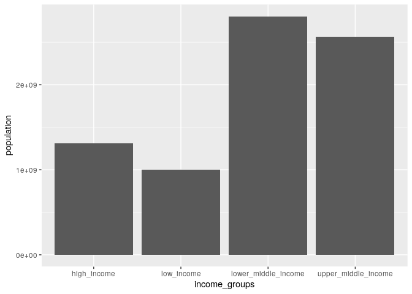

Homework1
================

``` r
library(ggplot2)
library(dplyr)
```

``` r
countries = read.csv("data/ddf--entities--geo--country.csv")
regions = read.csv("data/ddf--entities--geo--world_4region.csv")
```

Problem 1
---------

I recieved a score of 4 out of 13 on the gapminder test. Most of the answers somewhat surprised me, in particular the question on natural disaster deaths. I had figured that given the population growth and because the question was about absolute numbers and not percentages that deaths would have increased.

"Where does the majority of the world population live?"

``` r
population = read.csv("data/ddf--datapoints--population_total--by--geo--time.csv") %>%
              filter(time=="2019")
income_breakdown <- left_join(population, countries, by=c("geo" = "country")) %>%
      filter(income_groups!="") %>%
      group_by(income_groups) %>%
      summarise(population=sum(as.numeric(population_total)))
ggplot(income_breakdown) + geom_bar(aes(x=income_groups, y=population), stat="identity")
```



From the above graph we can see that the majority of the world lives in middle income countries. Both of the two bars that make up the middle income bucket are the two tallest bars on the graph, meaning that there are a good deal more people in middle income countries than high or low income countries.

Problem 2
---------

``` r
gdp_data = read.csv("data/ddf--datapoints--gdppercapita_us_inflation_adjusted--by--geo--time.csv")
gdp_data <- left_join(gdp_data, countries, by=c("geo" = "country"))
region_level <- gdp_data %>% group_by(time, world_4region) %>%
                  summarise(gdp_per_cap = mean(gdppercapita_us_inflation_adjusted))
country_level <- gdp_data %>% group_by(time, name) %>%
                  summarise(gdp_per_cap = sum(gdppercapita_us_inflation_adjusted)) %>%
                  group_by(name) %>%
                  summarise(gdp_per_cap = mean(gdp_per_cap)) %>%
                  top_n(25)

ggplot(region_level) + geom_line(aes(x=time, y=gdp_per_cap, color=world_4region)) +
  ylab("Average Country GDP per cap") + xlab("Year")
```


``` r
ggplot(country_level) + 
  geom_bar(aes(x=reorder(name, -gdp_per_cap), y=gdp_per_cap), stat="identity") +
  theme(axis.text.x = element_text(angle = 90)) +
  ylab("Average Country GDP per cap") + xlab("Country")
```


From the above two figures we are abe to gain some insights into the income distribution and changes of GDP per captita over time. From the line chart colored by region, we are able to see that the average country in europe has historically had a higher GDP/cap than the average countryies in the other three regions. From the same chart, we are also able to see interesting peaks and valleys within each region, such as the jump in asia during the 1970s, or the dip in europe around the year 1990. Overall the values trend upwards for all regions on the graph. The exceptions being the two mentioned above, as well as the recent drop in the americas around 2015. From the bar chart, we are able to see the top 25 countries by GDP and can get a good idea at some of the countries driving the regions. The top list has some expected names such as the US, Norway, and Canada, but many of the countries in the top 25 are small countries that are considered to be tax havens, explaining why there is so much wealth in them. This points to the biggest caveat of the conclusions which is that the averages taken are straight averages and not weighted averages. This means that a country like china which would be one of the major drivers of overall region GDP/cap is equally weighted against other smaller countries. This means that if large countries have significantly different values than others in the region, the region averages may not be very accurate.

Problem 3
---------

``` r
infant_rate <- read.csv("data/ddf--datapoints--infant_mortality_rate_per_1000_births--by--geo--time.csv")
infant_rate <- left_join(infant_rate, gdp_data, by=c("geo", "time"))
life_expectancy <- read.csv("data/ddf--datapoints--life_expectancy_at_birth_data_from_ihme--by--geo--time.csv")
life_expectancy <- left_join(life_expectancy, gdp_data, by=c("geo", "time")) 

region_level <- life_expectancy %>% group_by(time, world_4region) %>%
                  summarise(life_expectancy_per_cap = mean(life_expectancy_at_birth_data_from_ihme / gdppercapita_us_inflation_adjusted),
                            life_expectancy = mean(life_expectancy_at_birth_data_from_ihme)) %>%
                  filter(world_4region != 'NA')

ggplot(region_level) + geom_line(aes(x=time, y=life_expectancy, color=world_4region)) +
  ylab("Life Expectancy") + xlab("Year")
```


From the above graph, we can get an idea of how life expectancy has changed over time, and how GDP can affect that value. We can see that for all 4 regions, the life expectancy at birth has increased over time from 1990. Each region has gained over 5 years of life expectancy over the past 25 years. We can see that europe has the highest, followed by the americas, asia, and africa. From the previous problem, we saw this to also be the ordering of GDP per capita within the regions, indicating a positive relationship between the two values. This can further be seen in the below graph:

``` r
country_level <- life_expectancy %>% group_by(time, name) %>%
                  group_by(name) %>%
                  summarise(life_expectancy_per_cap = mean(life_expectancy_at_birth_data_from_ihme), gdp_per_cap = mean(gdppercapita_us_inflation_adjusted))

ggplot(country_level) + 
  geom_point(aes(x=gdp_per_cap, y=life_expectancy_per_cap), stat="identity") +
  ylab("Life Expectancy") + xlab("GDP per Capita")
```


This scatterplot represents the average GDP per capita compared agains the average life expectancy over the entire time period for all countries within the data. Each country is a point. From this graph, we can clearly see an positive relationship with GDP and life expectancy, although the relationship doesn't seem to be linear.

``` r
region_level <- infant_rate %>% group_by(time, world_4region) %>%
                  summarise(mortality_rate = mean(infant_mortality_rate_per_1000_births)) %>%
                  filter(world_4region != 'NA')

ggplot(region_level) + geom_line(aes(x=time, y=mortality_rate, color=world_4region)) +
  ylab("Infant Deaths per 1000") + xlab("Year")
```


From the above graph, we can see that infant mortality rate follows a similar trend in terms of life expectancy in that a higher GDP produces more desireable results. The graph tells the same story that the previous graphs on life expectancy tell. We see europe with the lowest death rate, followed by the americas, asia, and africa, again mirroring the GDP comparisons from before, and all decreasing over time.

``` r
country_level <- infant_rate %>% group_by(time, name) %>%
                  group_by(name) %>%
                  summarise(infant_rate = mean(infant_mortality_rate_per_1000_births), gdp_per_cap = mean(gdppercapita_us_inflation_adjusted))

ggplot(country_level) + 
  geom_point(aes(x=gdp_per_cap, y=infant_rate), stat="identity") +
  ylab("Infant Mortality Rate") + xlab("GDP per Capita")
```


We see the same type of relationship in the above scatter plot, which is that higher GDP produces more positive results. There clearly is a negative relationship between GDP and infant mortailty rates, with each point representing a country's average values for those stats over the range of time.

Problem 4
---------

``` r
fertility <- read.csv("data/ddf--datapoints--children_per_woman_total_fertility--by--geo--time.csv")
fertility <- left_join(fertility, gdp_data, by=c("geo", "time"))
region_level <- fertility %>% group_by(time, world_4region) %>%
                  summarise(fertility = mean(children_per_woman_total_fertility)) %>%
                  filter(world_4region != 'NA')

ggplot(region_level) + geom_line(aes(x=time, y=fertility, color=world_4region)) +
  ylab("Children per Woman") + xlab("Year")
```


From the above graph, we can see that since the year 1960, the number of children per women has steadily decreased across all world regions. Again, the regions appear to be in order of GDP, with europe having the highest GDP and lowest number of children per women, and africa having the reverse.

``` r
country_level <- fertility %>% group_by(time, name) %>%
                  group_by(name) %>%
                  summarise(fertility = mean(children_per_woman_total_fertility), gdp_per_cap = mean(gdppercapita_us_inflation_adjusted))

ggplot(country_level) + 
  geom_point(aes(x=gdp_per_cap, y=fertility), stat="identity") +
  ylab("Children per Woman") + xlab("GDP per Capita")
```


From the above scatter plot we can see the country level data, with each point representing a country's average from ~1960 onward in terms of both statistics. From the plot, we can see a clear negative relationship between children per woman, and GDP per capita, implying that birth rates are much higher in low GDP countries than in high GDP countries.

Problem 5
---------

I used static plots to answer the previous questions. Interactive plots and figures are particularly useful and I believe more powerful than static plots, but need to be well navigated in order to unlock their value. One of the biggest advantages of interactive plots is that they benefit from animation. This essentially gives the creator of the figure another dimension that they can plot against, without giving up interpretability of the figure. Having more than 2 dimensions on a static plot can sometimes make it challenging to understand, but animation is often easy to understand, and can be particularly useful for dimensions such as time. Interactive plots also benefit in the area of data exploration. When you look at a static plot, what you see is what you get. You aren't able to do drill down analysis on a particular bar or point or bubble. However, this is not the case with interactive figures. If you see an outlier in the data, the figure can be setup in such a way that more granular data is presented when a user of the figure clicks on the data.

However, the biggest drawback of interactive plots is that it can be more challenging to convey a particular point. If there is one very specific point that you are trying to make, a static graph may be the best way to show it, because it doesn't allow someone to change or play with the figure, so as long as it is well thought out, that point will shine through. With an interactive graph, you run the risk of possibly confusing someone if they don't understand the underlying data well, and they may end up reaching different or more granular conclusions than you intended.
